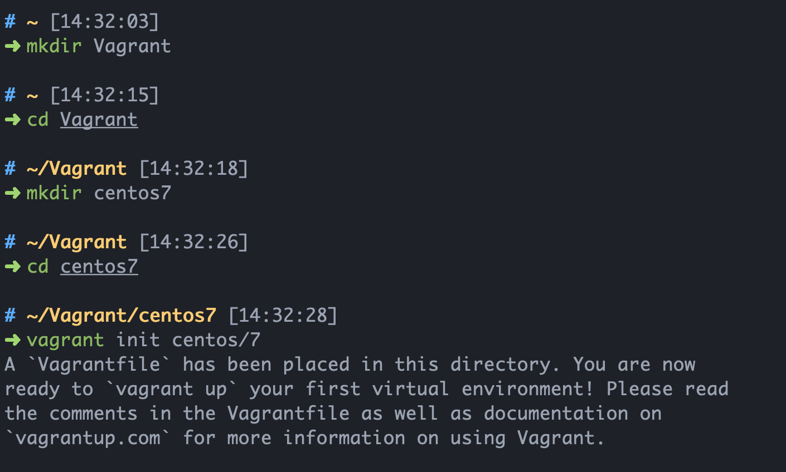
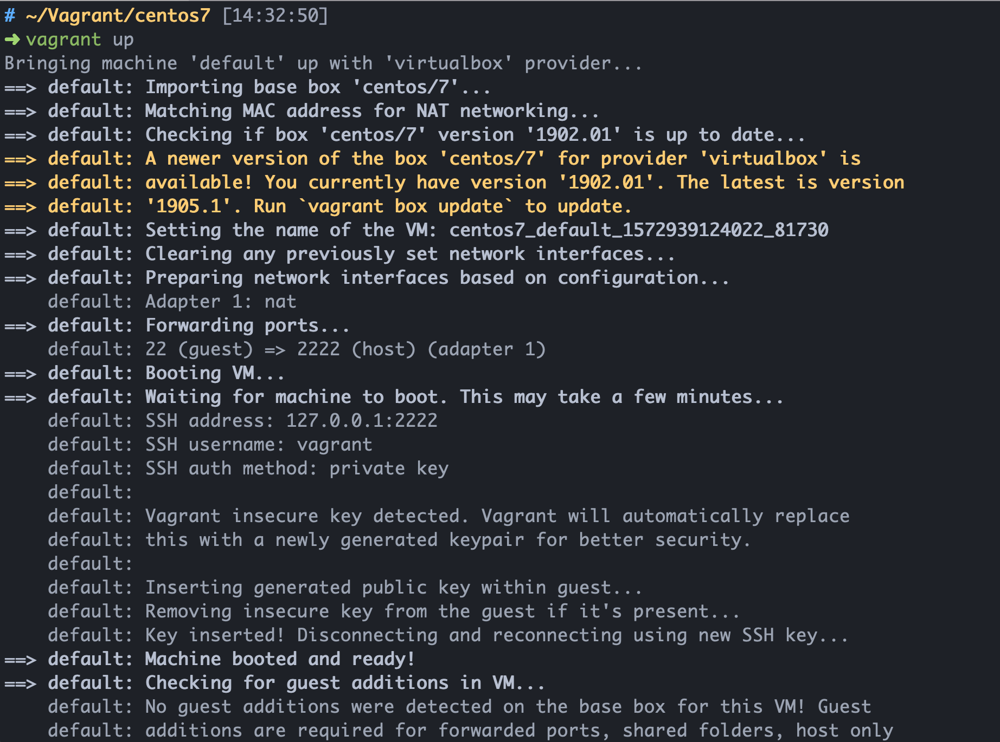
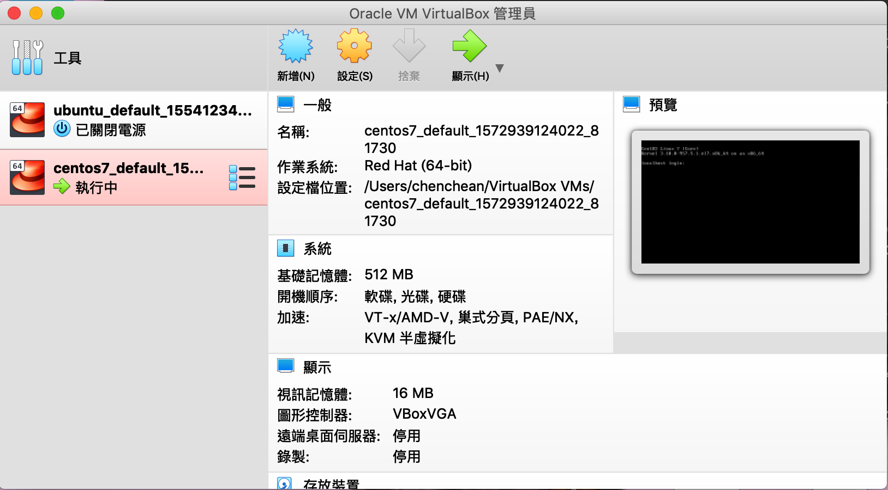
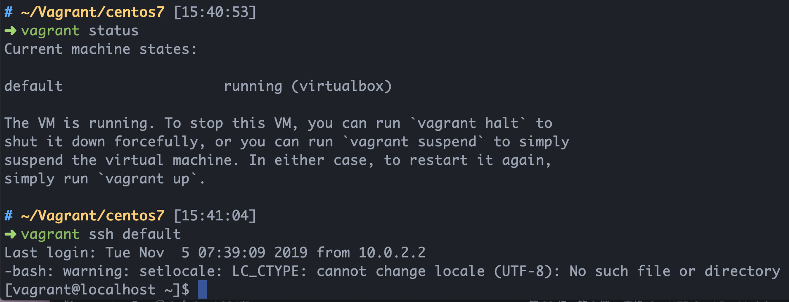

# 為什麼要使用Vagrant
### Vagrant是一款能夠幫我們快速部署各種環境架構的軟體，也可以幫我們管理我們的VM。傳統上如果我們要創建VM，我們需要先去找尋我們需要的OS並進行一些設定，VM運行後再去安裝我們需要的軟體。在Vagrant內，我們可以透過Vagrantfile去進行相關設定。

---
## VirtualBox安裝與Vagrant安裝
Vagrant背後可以使用VirtualBox作為虛擬機，因此在使用Vagrant前，請先安裝[VirtualBox](https://www.virtualbox.org/)和[Vagrant](https://www.vagrantup.com/downloads.html)。

* 若要使用VMWare作為虛擬機，可在vagrantfile中更改。
---
## Vagrant使用
Vagrant基本上是透過前面所提的Vagrantfile去完成一系列自動化完成的動作。我們可以透過`vagrant init`去初始化我們的Vagrantfile文件，或是透過`vagrant init <boxname> `安裝在[Vagrant Cloud](https://app.vagrantup.com/boxes/search)已經定義好的box。以下我們以安裝centos7為例。

透過`vagrant up`運行虛擬機

我們可以到VirtualBox發現目前有一台虛擬機是啟動的狀況

至於要如何操控這台虛擬器，我們可以透過 `vagrant status `查看vagrantfile所建立的虛擬機，再透過vagrant 所提供的ssh連上此虛擬機

